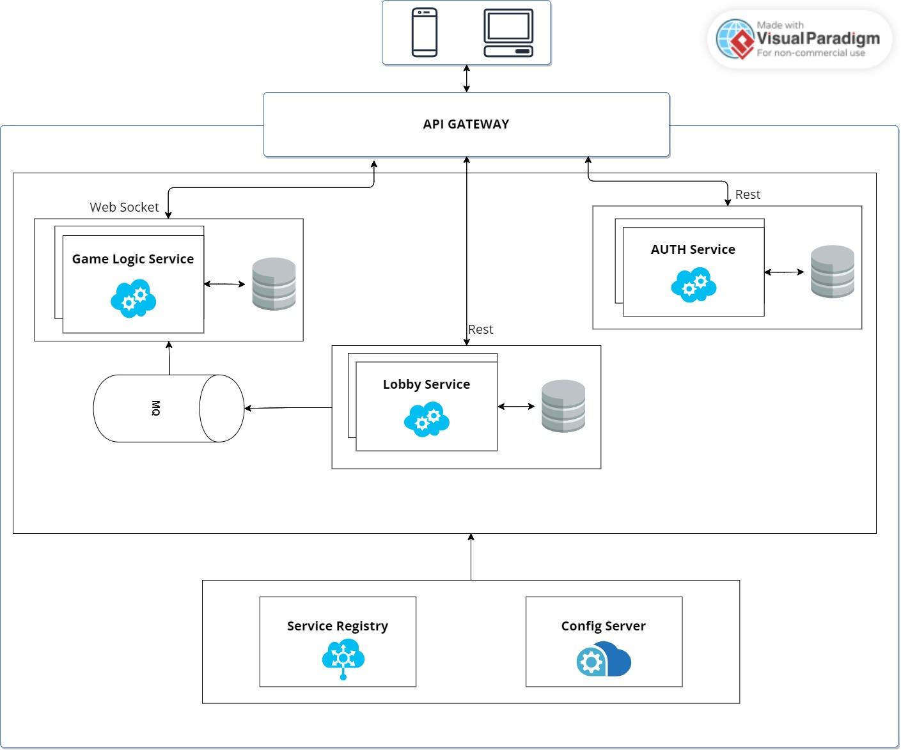

# Battleship Microservices Project

The Battleship Microservices Project is a Java-based implementation of the classic game Battleship using a microservices
architecture. This README provides an overview of the project structure, technologies used, and how the various
microservices interact to create the game.

## Getting Started

To get started with the Battleship Microservices Project, follow these steps to run the microservices using Docker:

1. Clone the repository to your local machine:

```bash
git clone https://github.com/your-username/battleship-microservices.git
cd battleship-microservices
```

2. **Build Docker Images**: Navigate to each microservice directory and build the Docker image (replace `service-name`
   with the actual service's name):


3. **Run Docker Containers**: Run each microservice's Docker container, specifying desired host ports:

Repeat these steps for each microservice, ensuring distinct ports for each.

4. **Access the Application**: With all services running, access the application through the API Gateway in your web
   browser at `http://localhost:8080`.

## Design Diagram

<p align="center">
  
</p>

## Technologies Used

- Java
- Spring Boot
- Eureka Discovery
- Redis
- MongoDB
- MySQL
- RabbitMQ
- Docker
- Karate (Cucumber)
- Prometheus

### 1. Registry Service

The Registry Service is responsible for service discovery through Eureka. Microservices register themselves, enabling
dynamic scaling, load balancing, and routing of requests.

### 2. API Gateway

The API Gateway serves as the entry point, directing requests to microservices based on defined routes. It handles load
balancing, security enforcement, and central request routing.

### 3. Auth Service

The Auth Service manages user authentication and token generation, ensuring secure communication across microservices
and maintaining user sessions.

### 4. Game Lobby Service

The Game Lobby Service coordinates game lobbies, ensuring they are ready to start. Upon readiness, it communicates
through RabbitMQ to initiate game creation.

# Gameplay Overview

Battleship is a classic two-player game that combines strategy and deduction. Players take turns guessing the locations
of their opponent's ships in an attempt to sink them. In this implementation, the gameplay is divided into two distinct
phases: Ship Placement Phase and Battle Phase.

### Ship Placement Phase

1. Players register and log in using the Auth Service to receive an authentication token.
2. Players access the Game Lobby Service to create or join game lobbies.
3. Once the lobby is full, players are prompted to place their ships on their respective grids. During this phase,
   there's no waiting for turns. Both players can simultaneously position their ships, enhancing the game's pace.
4. Players can strategically position their fleet to optimize their defensive and offensive capabilities.
5. Once both players have placed their ships, the Ship Placement Phase concludes, and the Battle Phase commences.

### Battle Phase

1. With ship positions locked in, the Battle Phase begins, and players take alternating turns.
2. Players select positions on their opponent's grid to fire shots. The Game Engine Service validates the shots and
   updates the game state.
3. Feedback is provided to the players regarding the outcome of their shots – whether they hit, miss, or sink an
   opponent's ship.
4. The fast-paced turn-based nature of the Battle Phase keeps players engaged as they strategize and anticipate their
   opponent's moves.
5. The game continues until one player's entire fleet is sunk, at which point the winner is determined.

### Winning the Game

The player who sinks all the opponent's ships first emerges victorious. The Game Engine Service meticulously tracks the
status of the game, culminating in the announcement of the winner once the Battle Phase concludes.

## To-Do List

- [x] **Architecture Diagram**: Create diagrams illustrating the microservices architecture and communication flow.
  Clearly depict how each service interacts, communicates, and collaborates.
- [x] Complete README overview, technologies, and microservices descriptions.
- [x] Add gameplay mechanics, communication patterns, testing, metrics monitoring, and HATEOAS.
- [ ] **Stress Testing**: Perform stress testing to assess the application's performance and scalability under heavy
  loads. Document the testing process, tools used, and results in the README.
- [ ] **Kubernetes Configuration**: Provide instructions on how to deploy the microservices using Kubernetes. Include
  YAML configuration files and step-by-step deployment guidelines.
